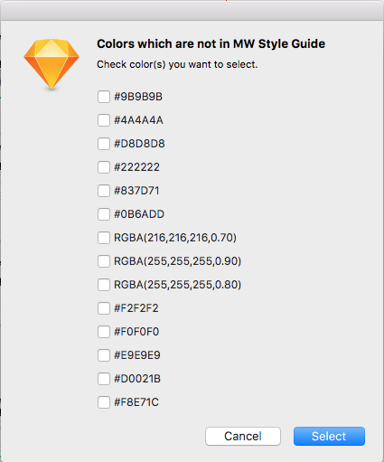

# Sketch MW Style Guide Color Checker

- Show colors which are not in MW style guide color palette
- Select layers which have those colors

## Install

Download [zip](https://github.com/tomoyukikashiro/SketchMWStyleGuideColorChecker/archive/master.zip), unzip the archive and double click .sketchplugin file.

## Usage

1. Select Page
2. `Plugins` > `Style Guide Color Checker` > `Check all`

This plugin check color in `page` basis so if you have multiple page in a sketch file you need to run this for each pages.

## Bug

Plugin does not understand layer color correctly which also has `opacity` and that color as 'RGBA' in Popup (you can see example for that in screenshop above).
So That color which has `opacity` has correct color which is in MW Style Guide Please ignore that `RGBA` selection.
